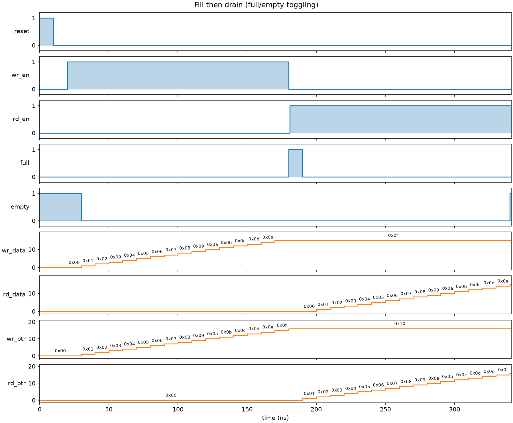
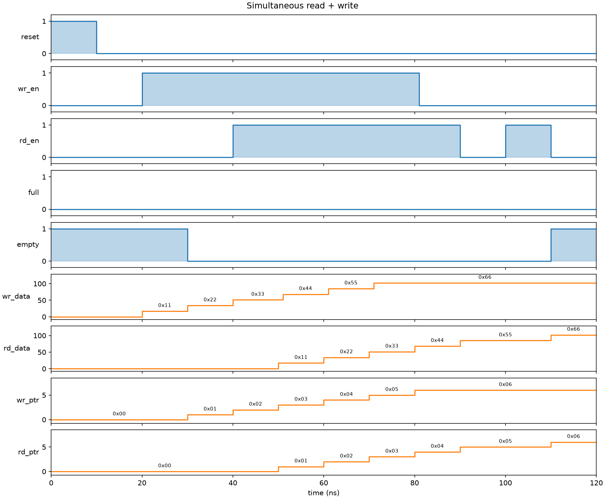
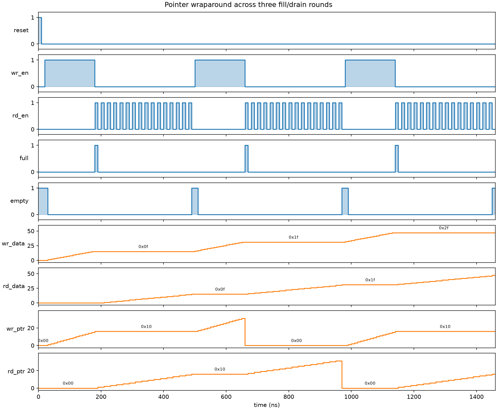

# FIFO with AXI4-Stream

The RTL and its logic here are hand-written by me. I also wrote some of the cocotb testbenches myself; AI assistance filled in the rest of the test coverage and wrote the waveform-rendering script, but the FIFO and the AXI4-Stream wrapper are untouched by it.

This is a parameterized synchronous FIFO with an AXI4-Stream wrapper on top of it, so it can drop into anything expecting a standard AXIS handshake instead of raw read/write enables.

## What's in here

`rtl/FIFO.sv` is the actual FIFO: a circular buffer with separate write and read pointers, one bit wider than needed to address the memory so wrapping the pointer around lets `full` and `empty` be told apart with simple pointer comparisons instead of a separate counter. `DATA_WIDTH` and `DEPTH` are both parameters.

`rtl/fifo_axi_stream.sv` wraps the FIFO in an AXI4-Stream slave/master interface — `s_axis_tvalid`/`s_axis_tready` on the write side, `m_axis_tvalid`/`m_axis_tready` on the read side — so `wr_en`/`rd_en` just become the AND of valid and ready on each side.

`sim/test_fifo.py` is the cocotb testbench. It covers reset behavior, basic write/read, filling and draining, gapless back-to-back writes and reads, simultaneous read+write, pointer wraparound, and what happens if you assert `wr_en` while full or `rd_en` while empty (spoiler: nothing stops you, and it'll quietly corrupt data — there's no overflow/underflow protection in this design, so that's on whatever's driving it).

`sim/render_waveforms.py` runs a few of those tests in isolation with waveform dumping on, converts the FST dump to VCD, and plots the signals to PNGs under `docs/waveforms/`.

## Simulation

I'm using cocotb with Icarus Verilog for simple, Python-based simulation. `cd sim && make` runs the full test suite.

## Waveforms

Fill then drain — writing until full, then reading until empty. You can see `full` and `empty` each pulse for exactly one cycle at the transition points, and the write/read pointers count straight up without resetting.

Simultaneous read and write — once the FIFO has a couple of entries in it, asserting `rd_en` and `wr_en` on the same cycle just shifts data through without the occupancy count changing, and neither `full` nor `empty` ever asserts here.

Pointer wraparound — three full fill/drain rounds back to back, enough for the pointers to wrap past the top of the buffer twice. Data stays consistent across the wrap, which is really the whole point of using a pointer MSB instead of a separate counter for the full/empty logic.

## Repo layout

- `rtl/` — the FIFO and its AXI4-Stream wrapper
- `sim/` — cocotb testbench, waveform script, and the Makefile that drives Icarus Verilog
- `docs/waveforms/` — rendered waveform PNGs
